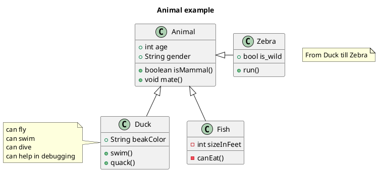
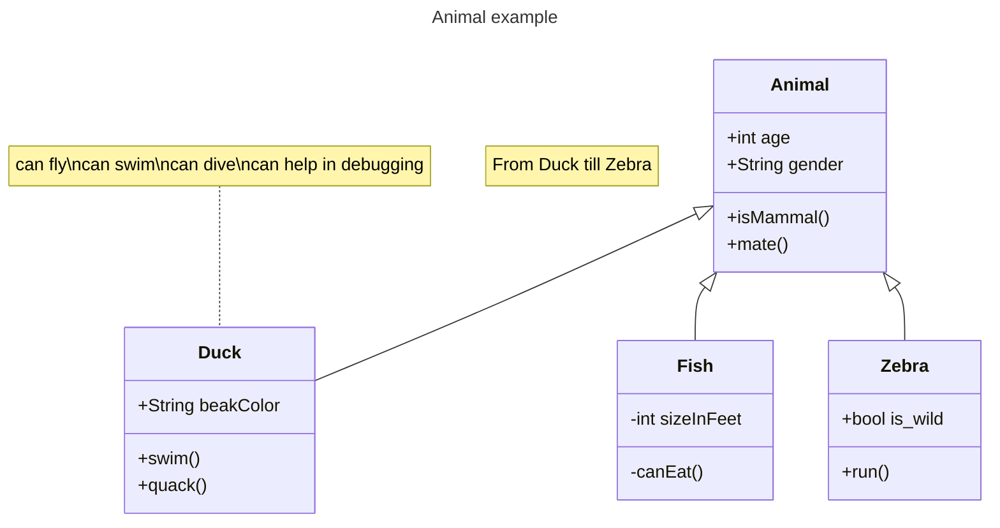

---
export_on_save:
  html: true
---

# seminario-1

## Markdown

- item
- item
- item

1. valor
2. valor
3. valor

| title1 | title2 |
| ------ | ------ |
| a      | b      |

[Markdown](https://docs.github.com/pt/get-started/writing-on-github/getting-started-with-writing-and-formatting-on-github/basic-writing-and-formatting-syntax)

## Plantuml

[PlantUML Class Diagram](https://plantuml.com/class-diagram)

## Mermaid

[Mermaid Class Diagram](https://mermaid.js.org/syntax/classDiagram.html)

## Markdown Preview Enhanced

[Markdown Preview Enhanced](https://shd101wyy.github.io/markdown-preview-enhanced/#/)

@import "src/Classe.java"

### HTML Export

[html-export](https://shd101wyy.github.io/markdown-preview-enhanced/#/html?id=html-export)

Right click at the preview, click HTML tab.
Then choose:

HTML (offline) Choose this option if you are only going to use this html file locally.
HTML (cdn hosted) Choose this option if you want to deploy your html file remotely.

